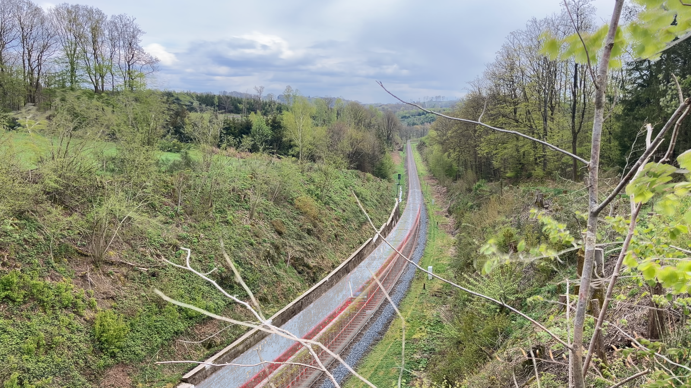

# Web Technologien // begleitendes Projekt Sommersemester 2024

Bilder mit Langzeitbelichtung sind gar nicht so einfach zu erstellen, vor allem, wenn man möglichst
viel Kontrolle über das Endergebnis haben möchte. In unserem Ansatz, bildet ein Film den Ausgangspunkt. Diesen zerlegen
wir in Einzelbilder und montieren die Einzelbilder mit verschiedenen Blendmodes zu einem Bild mit
Langzeitbelichtungseffekt zusammen.

# Wie startet man das Projekt?
Das Projekt kann auf zwei Weisen gestartet werden, entweder mit Docker-Compose(empfohlen) oder Nativ.

## Wie führt man das Projekt mit Docker Compose aus?
Man muss Docker Compose installiert haben und kann dann in diesem "Root" Verzeichnis 

```sh
docker-compose up -d
```
ausführen und erreicht das Frontend dann unter `localhost:8080`.

## Wie führt man das Projekt Nativ aus?

## Frontend
Das Frontend ist in Vue 3 entwickelt.
Um das Frontend Nativ zu starten muss man in dem `frontend` Ordner sein und folgenden Befehl ausführen:
```sh
npm install && npm run dev
```
Das Frontend ist dann unter `localhost:8080` erreichbar.

## Backend
Das Backend ist in Rust geschrieben und setzt die Rust Toolchain voraus und kann folgendermaßen gestartet werden.
Dazu muss man in dem `backend` Ordner sein und folgenden Befehl ausführen:

```sh
cargo run --release
```
Das Backend ist dann unter `localhost:8081` erreichbar.

# Wie benutzt man die Anwendung?
Die Anwendung wird über das Frontend genutzt, das unter `localhost:8080` erreichbar ist. Hier findest du eine Übersicht aller bereits erstellten Projekte und die Möglichkeit, neue Projekte zu erstellen.

## 1. Erstellen eines neuen Projekts
- Klicke auf **"Neues Projekt erstellen"**.
- Gib einen **Namen** für das Projekt ein.
- Wähle ein **Video** aus, das du verwenden möchtest.
- Bestimme die **Framerate** (Bilder pro Sekunde), mit der das Video in Einzelbilder zerschnitten wird.
- Optional kannst du die **Skalierung** der Bilder anpassen, um die Größe zu verändern.

## 2. Hochladen des Videos
- Sobald du alle Einstellungen vorgenommen hast, klicke auf **"Video hochladen"**.
- Nach dem Upload wird die **Timeline** des Videos geöffnet, in der du die Frames des Videos sehen kannst.

## 3. Bearbeiten der Timeline
- In der Timeline kannst du einzelne **Bilder auswählen**, die vom finalen Langzeitbelichtungsbild **ausgeschlossen** werden sollen.
- Du hast außerdem die Möglichkeit, bestimmten **Frames ein Gewicht (Weight)** zuzuweisen, wodurch diese Frames einen größeren Einfluss auf das resultierende Langzeitbelichtungsbild haben und stärker hervorgehoben werden.

## 4. Erstellen des Langzeitbelichtungsbildes
- Nachdem du deine Auswahl getroffen hast, klicke auf **"Send Unselected Frames for Image Generation"**.
- Die Anwendung erstellt dann automatisch das Langzeitbelichtungsbild basierend auf den nicht ausgewählten Bildern und den festgelegten Gewichten.

## Aufbau der Anwendung
Die Anwendung besteht aus zwei Hauptkomponenten:

### 1. **Frontend (Vue.js)**
Das Frontend ist mit **Vue 3** entwickelt und dient als Benutzeroberfläche zur Verwaltung und Bearbeitung von Projekten:

- **Projektverwaltung**: Benutzer können neue Projekte erstellen, Videos hochladen und in Einzelbilder zerlegen. Dabei lassen sich Framerate und Skalierung anpassen.
- **Timeline**: Nach dem Hochladen wird eine Timeline angezeigt, in der der Benutzer Frames auswählen oder ausschließen kann, um ihren Einfluss auf das Langzeitbelichtungsbild zu steuern.
- **Langzeitbelichtungsbilderstellung**: Durch das Anpassen der Timeline und Zuweisen von Gewichten zu Frames wird ein Langzeitbelichtungsbild generiert.

### 2. **Backend (Rust + Actix Web)**
Das Backend ist in **Rust** mit **Actix Web** implementiert und verarbeitet die Videodaten sowie die Projekterstellung:

- **API-Endpunkte**:
  - `GET /projects`: Liefert eine Liste aller Projekte.
  - `GET /projects/{id}`: Ruft die Metadaten eines spezifischen Projekts ab.
  - `POST /projects`: Erstellt ein neues Projekt oder aktualisiert ein bestehendes, basierend auf dem Projekt-ID, Video und Parametern wie FPS und Skalierung.
  - `DELETE /projects/{id}`: Löscht ein Projekt anhand seiner ID.
  - `POST /projects/{project_id}/createLongExposureImage`: Erstellt ein Langzeitbelichtungsbild basierend auf den vom Benutzer ausgewählten Frames.
- **FFmpeg**: Hochgeladene Videos werden mit **FFmpeg** in Einzelbilder und Thumbnails zerteilt und auf der Festplatte gespeichert.
- **Projektinformationen**: Zu jedem Projekt wird eine Manifestdatei angelegt, die Projektdetails (Name, FPS, Skalierung) und das erzeugte Langzeitbelichtungsbild speichert.

# Reviewprozess
Der Reviewprozess für das Repository ist in der [review-prozess.md](review-prozess.md) zu finden.

# Zeitaufwand
Der Zeitaufwand für dieses Projekt ist in der [time.md](time.md) zu finden.

# Ergebnis:


